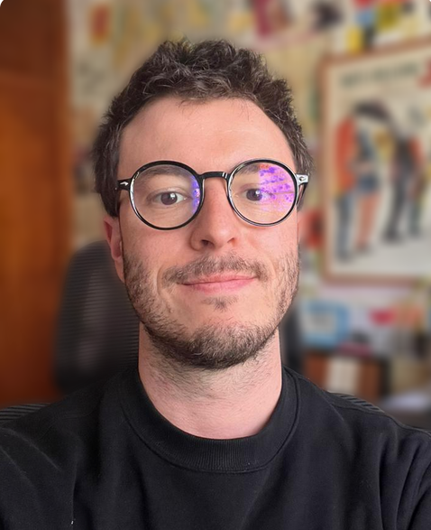

<head>
  <link rel="stylesheet" href="{{ '/assets/css/styles.css' | relative_url }}">
</head>

 

   <!--  -->
   <h1 style="color: #cc0000; font-size: 2.5em; margin: -4;"><b>Matías Bilkis, PhD</b></h1>

   <b> Short bio: </b> <i>MB holds a degree in physics (UNLP), a PhD in physics (Grup d'Informació Quàntica - Universitat Autònoma de Barcelona), co-founder and director of the Quantum Machine Learning Group at the Center for Computer Vision (QML-CVC). His research takes place in interdisciplinary fields, in areas such as quantum physics, artificial intelligence, and technology as an element of social innovation.

 

 

   Quantum technologist:
   I am an expert in <b>machine learning</b> and <b>quantum technologies</b>. I have then created the Quantum Machine Learning research group, in the Computer Vision Center of Barcelona.
 

 

   Researcher:
   I hold a <a href="https://drive.google.com/file/d/1se8t7J-68Yr_K-4lq_TZO94QsO3_eEjR/view">PhD in physics</a>, and <b>group leader</b> of <a href="https://qml.cvc.uab.es">QML-CVC group</a>. My research is inter-disciplinary, and I spend a lot of efforts in ML and physics communities to work on <b>quantum machine learning</b>.
 

 

   Scientific communicator and advisor:
   Communicating complex things in simple terms & strategic planning for scientific and technology initiatives.

   I work with both public and private institutions to develop quantum tech agendas adapted to this rapidly-changing times.
 

